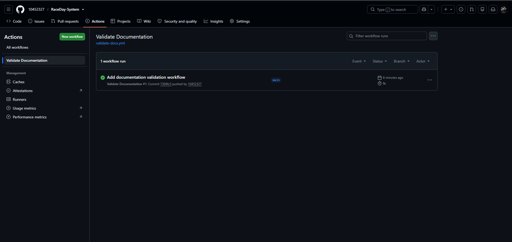

# RaceDay-System

## System Description

RaceDay-System is a database-driven race management system designed to manage race events, race categories, users, enrolments and race results. The system provides organisers and participants with structured information management for race-day activities.

## System Roles

### Organiser

The Organiser is responsible for managing race events, race categories, enrolments and race results. The Organiser can create and update event information and manage race results.

### Participant

The Participant can register for available race categories, view race event information, manage their enrolments and view their race results.

## Project Documentation

The project documentation is stored in the `/docs` folder.

- [ERD Diagram](docs/ERD.png)
- [API Endpoint Plan](docs/API-Endpoint-Plan.png)
- [SQL Database Script](docs/sql-script.sql)

## CI/CD Validation

GitHub Actions is used to automatically validate that the required documentation files are present in the `/docs` folder.

The workflow checks for:

- ERD diagram
- API Endpoint Plan
- SQL database script

### CI/CD Screenshot

## YouTube Demonstration

YouTube video link: https://youtube.com/shorts/ImYBVdR7pK0?si=8BjtKE-G5OrFo51P  
